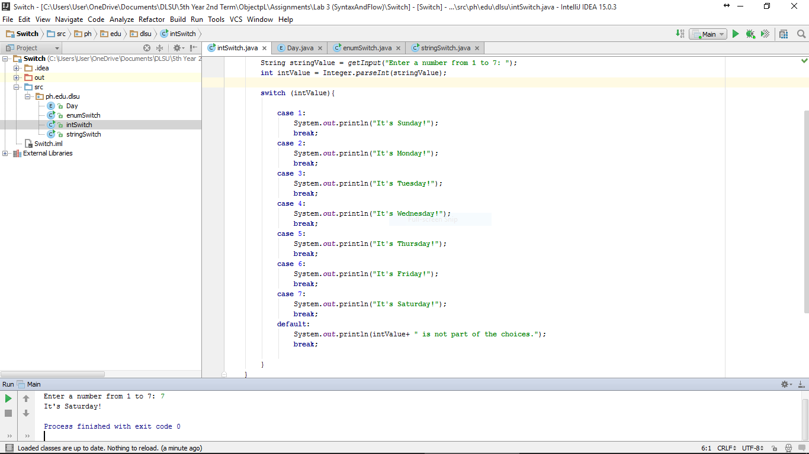
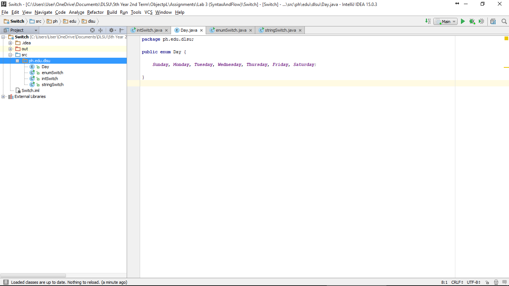
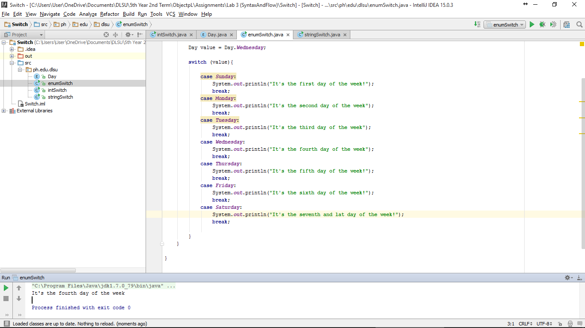
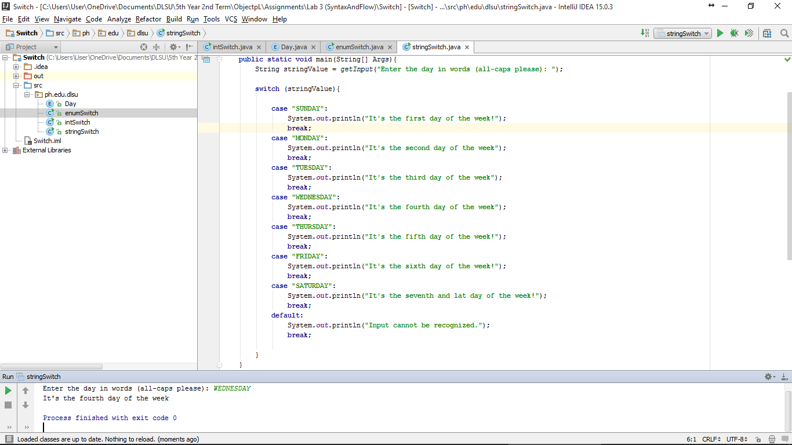

#Switch

Trying Switch-Cases in String, Enumeration, and Integer.

#ScreenShots

#Codes
###IntegerSwitch
~~~
package ph.edu.dlsu;
import java.io.*;

public class intSwitch {

    public static void main(String[] args) {

        String stringValue = getInput("Enter a number from 1 to 7: ");
        int intValue = Integer.parseInt(stringValue);

        switch (intValue){

            case 1:
                System.out.println("It's Sunday!");
                break;
            case 2:
                System.out.println("It's Monday!");
                break;
            case 3:
                System.out.println("It's Tuesday!");
                break;
            case 4:
                System.out.println("It's Wednesday!");
                break;
            case 5:
                System.out.println("It's Thursday!");
                break;
            case 6:
                System.out.println("It's Friday!");
                break;
            case 7:
                System.out.println("It's Saturday!");
                break;
            default:
                System.out.println(intValue+ " is not part of the choices.");
                break;

        }
    }

    private static String getInput(String prompt) {
        BufferedReader stdin = new BufferedReader(
                new InputStreamReader(System.in));

        System.out.print(prompt);
        System.out.flush();

        try {
            return stdin.readLine();
        } catch (Exception e) {
            return "Error: " + e.getMessage();
        }
    }

}
~~~

###EnumDay
~~~
package ph.edu.dlsu;

public enum Day {

    Sunday, Monday, Tuesday, Wednesday, Thursday, Friday, Saturday;

}
~~~

###EnumSwitch
~~~
package ph.edu.dlsu;

public class enumSwitch {

    public static void main(String[] args) {

        Day value = Day.Wednesday;

        switch (value){

            case Sunday:
                System.out.println("It's the first day of the week!");
                break;
            case Monday:
                System.out.println("It's the second day of the week");
                break;
            case Tuesday:
                System.out.println("It's the third day of the week");
                break;
            case Wednesday:
                System.out.println("It's the fourth day of the week");
                break;
            case Thursday:
                System.out.println("It's the fifth day of the week!");
                break;
            case Friday:
                System.out.println("It's the sixth day of the week!");
                break;
            case Saturday:
                System.out.println("It's the seventh and lat day of the week!");
                break;

        }
    }

}
~~~

###StringSwitch
~~~
package ph.edu.dlsu;
import java.io.*;

public class stringSwitch {

    public static void main(String[] Args){
        String stringValue = getInput("Enter the day in words (all-caps please): ");

        switch (stringValue){

            case "SUNDAY":
                System.out.println("It's the first day of the week!");
                break;
            case "MONDAY":
                System.out.println("It's the second day of the week");
                break;
            case "TUESDAY":
                System.out.println("It's the third day of the week");
                break;
            case "WEDNESDAY":
                System.out.println("It's the fourth day of the week");
                break;
            case "THURSDAY":
                System.out.println("It's the fifth day of the week!");
                break;
            case "FRIDAY":
                System.out.println("It's the sixth day of the week!");
                break;
            case "SATURDAY":
                System.out.println("It's the seventh and lat day of the week!");
                break;
            default:
                System.out.println("Input cannot be recognized.");
                break;

        }
    }

    private static String getInput(String prompt) {
        BufferedReader stdin = new BufferedReader(
                new InputStreamReader(System.in));

        System.out.print(prompt);
        System.out.flush();

        try {
            return stdin.readLine();
        } catch (Exception e) {
            return "Error: " + e.getMessage();
        }
    }
}
~~~
